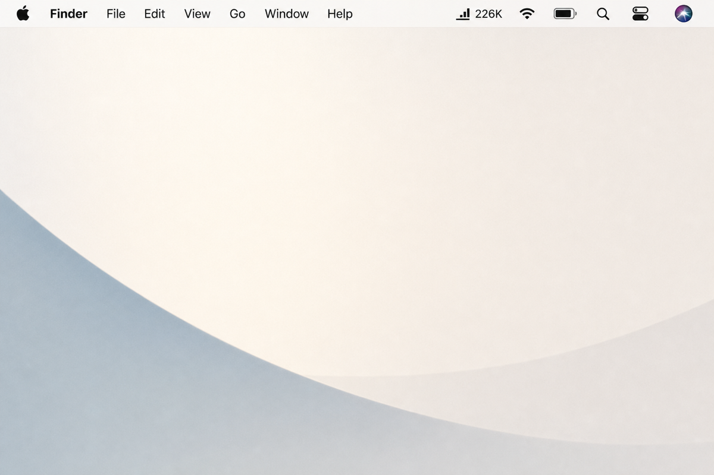
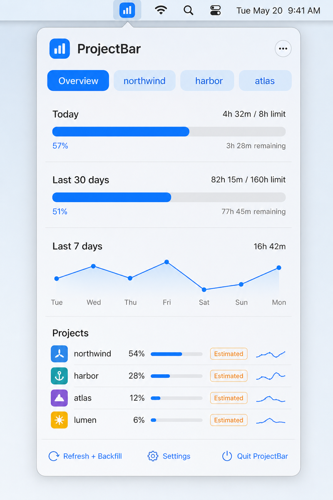
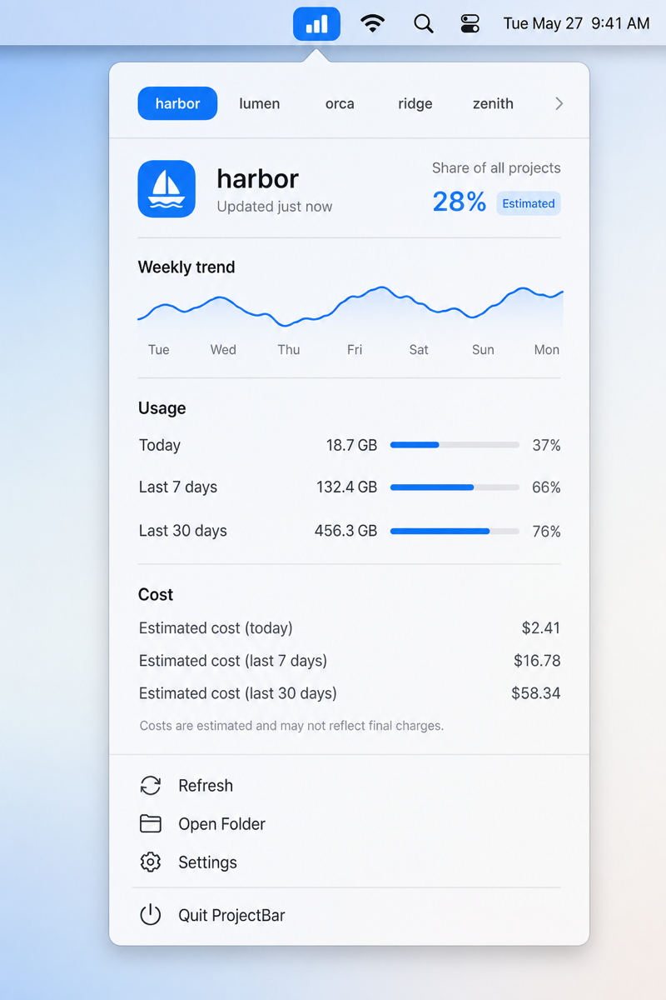

# ProjectBar

**See which project folders eat your Cursor tokens — right from the macOS menu bar.**

CodexBar-style glanceable UI, but tabs are **your projects**, not AI subscriptions.

<p align="center">
  
</p>

<p align="center">
  
  &nbsp;
  
</p>

---

## Why

You jump between several repos all day. Cursor’s billing view is account-wide. ProjectBar answers a simpler question:

> Where did my Agent tokens go this week?

## Features

- **Menu bar mark** with today’s spend (icon / icon+tokens / icon+project)
- **Overview** — today & 30-day meters, weekly sparkline, ranked projects
- **Per-project cards** — share-of-total %, sparklines, sessions, cost estimates
- **Allowlist** — only the folders you care about (e.g. `northwind`, `harbor`, `atlas`)
- **Hybrid attribution**
  - Backfill from local Cursor `agent-transcripts`
  - Live events via user-level Cursor hooks
- **Estimated** badge when totals are heuristic (not invoice-grade)
- **Private by default** — everything stays on your Mac

## Requirements

- macOS 14+
- Xcode / Swift 5.9+ toolchain

## Install

```bash
git clone https://github.com/pcloudata/projectbar.git
cd projectbar
./Scripts/build-app.sh
open dist/ProjectBar.app
```

Then open **Settings…** in the menu → add project folders → **Install Cursor Hooks**.

### CLI

```bash
projectbar-ingest backfill
projectbar-ingest status
projectbar-ingest install-hooks
```

## Settings

| Setting | Purpose |
|--------|---------|
| Projects | Allowlist + display-name aliases |
| $/1M tokens | Cost estimate rate (default `$3`) |
| Monthly token budget | Scales progress bars |
| Menu bar display | Icon only / tokens / project+tokens |
| Refresh interval | Poll cadence |
| Launch at login | Optional |
| Cursor hooks | Install / uninstall live ingest |

## Privacy

- Reads local Cursor workspace transcripts under `~/.cursor/projects/`
- Writes only to `~/Library/Application Support/ProjectBar/`
- Hooks **fail open** (never block the agent)
- No passwords, cookies, cloud sync, or telemetry

## Accuracy

Cursor does not expose official per-folder billing. Historical totals are often **estimated** from transcript size when token fields are missing. Live hooks improve attribution going forward when usage is present in the payload.

## Project layout

```
Sources/
  ProjectBar/          # SwiftUI MenuBarExtra app
  ProjectBarCore/      # Config, SQLite, backfill, hooks
  ProjectBarIngest/    # projectbar-ingest CLI
Scripts/build-app.sh   # Bundle .app + install CLI
docs/images/           # README screenshots
```

## License

[MIT](LICENSE)
